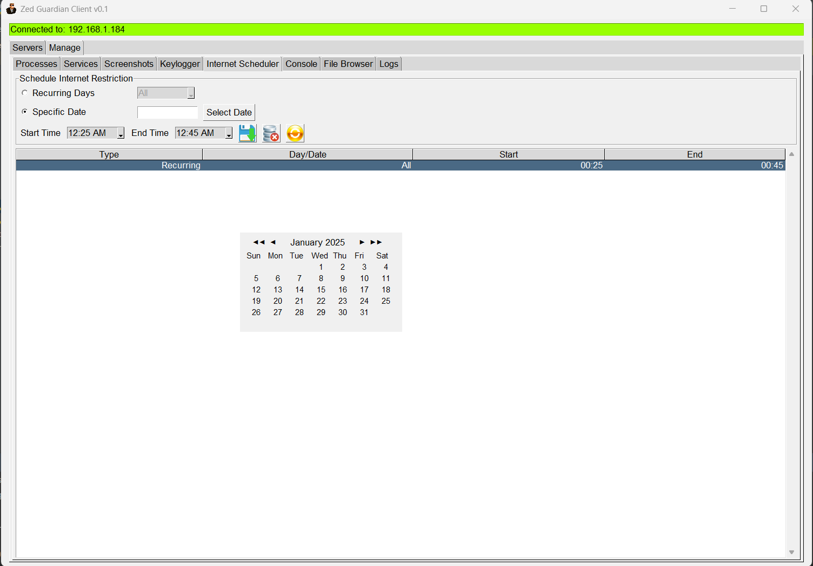

# ZED-Guardian
ZED Guardian is a parental control POC application designed to easily manage and monitor internet access, services, and applications on multiple PCs (Windows machines). It provides tools for scheduling internet restrictions, viewing and stopping running processes/services, keylogging, and taking screenshots of specific windows.

## Table of Contents
1. [Features](#features)
2. [Installation](#installation)
3. [Usage](#usage)
4. [How It Works](#how-it-works)
5. [Screenshots](#screenshots)
6. [Contributing](#contributing)
7. [License](#license)

## Features
- **Internet Control**: Restrict internet access via a proxy-based approach without touching firewalls or routers.
- **Service and Process Management**: View, manage, and terminate running processes and services.
- **Key logging**: Capture keystrokes to monitor activity.
- **Screenshot Manager**: Capture screenshots of specific windows or desktops.
- **Scheduling**: Set recurring or one-time schedules for blocking/unblocking internet.
- **Multi-PC Monitoring**: Connect to multiple clients and control them remotely.
- **Network Scanning**: Scan the network to identify online devices.


## Installation
1. Clone the repository:
```cmd
git clone https://github.com/your-username/ZED-Guardian.git cd ZED-Guardian
```
2. Install dependencies:
```cmd
pip install -r requirements.txt
```
3. Start the server:
```cmd
python server.py
```
4. Start the client:
```cmd
python client.py
```
**Note**: Ensure Python 3.9+ is installed on all devices.

## Usage
1. **Launch the Server**:
   Run the server script on the machine you want to monitor/control:
2. **Connect the Client**:
Open the client GUI and connect to the server using its IP address and port.
3. **Manage Connections**:
Use the client interface to:
- Block/unblock internet.
- View and terminate processes or services.
- Capture screenshots or logs.

## Screenshots

### GUI Overview & Network/Server Scanner


### Process & Services Manager


### CMD/Shell


### File Browser/Downloader


### Server Logs Viewer


### Net-Stop Scheduler



## How It Works
ZED Guardian operates in a client-server model:
1. **Server**:
   - Listens for connections from the client.
   - Executes commands sent by the client (e.g., block internet, fetch services).

2. **Client**:
   - Scans the local network for available servers.
   - Provides an intuitive GUI for managing connected PCs.

3. **Internet Blocking**:
   - Uses system-wide proxy settings to restrict internet access.
   - Automatically restores the default settings when unblocked.

## Contributing
Contributions are welcome! Feel free to fork the repository and submit a pull request with your changes.

## License
This project is licensed under the MIT License. See `LICENSE` for more details.
